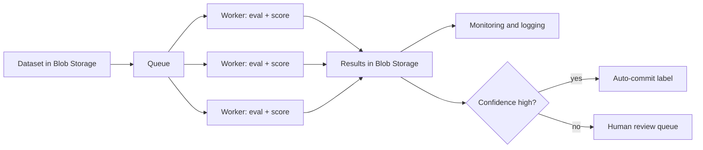

# capture-content-eval

A small benchmark for how well frontier models label image content, and more to the point, where they go wrong. You give a model a text description of a photo, it returns a primary category (is the photo about one subject, or a whole scene) plus a set of secondary labels with a confidence on each. The harness scores accuracy, label precision/recall/F1, and how honest the confidence is, then sorts the errors by type.

I built this in the area I worked on at Meta Reality Labs (capture metadata), and set it up the way micro1's Realm benchmarks work: write expert ground truth, run the models, score, then dig into how they fail.

## Why this matters

Lots of products auto-label images now (photo apps, marketplaces, moderation). The setup here fits that task. Primary tells you if there's one subject or a whole scene, which decides whether a tool sharpens one object or treats the frame as a whole. Labels say what's in it (here it's a small, diverse set, but it scales). The confidence is the most important part: if it's honest, you auto-approve what the model is sure about and only pay humans for the rest. Better calibration, less manual labeling :) It's also why two models with the same score aren't equal: one's unsure when it's wrong, the other's confidently wrong and you don't catch it. Which one you can live with depends on your requirements and how much you trust the model vs. a human in the loop.

## What I found

GPT-5.4 and Claude Sonnet 4.6, run zero-shot on 20 hand-authored items:

| model | primary acc | precision | recall | F1 | Brier |
|---|---|---|---|---|---|
| gpt-5.4 | 95% | 96% | 95% | 95% | 0.042 |
| claude-sonnet-4.6 | 100% | 84% | 99% | 90% | 0.127 |

The scores are close, but the two models fail in opposite ways. Claude nails every primary and barely misses a label (99% recall), but it over-labels: 11 labels that the description doesn't support, 9 of them at high confidence. That overconfidence is why its calibration (Brier) score is worse. GPT is the careful one, 96% precision, only 3 over-claims, and its confidence actually tracks how often it's right (Brier 0.042). The tradeoff is it's a little less complete.

If I were dropping one of these into a pipeline with no human checking each output, I'd lean GPT, because I can trust its confidence. Claude would need a precision filter first, or its extra labels get committed as fact. Same score on paper, different risk in production.

## How the labels were decided

The whole value of a benchmark is the ground truth, so here are the rules I used, since "why is this one labeled this way" is the first thing worth asking.

Primary is subject vs scene, decided by what your eye lands on first. If one thing clearly dominates, it's a subject (a sharp dog with blurry mountains behind it). If your attention has nowhere to settle, it's a scene (a busy street at night). Size isn't what decides it, focus is, so a tiny lone surfer on a big empty beach is still a subject.

Secondary labels come from a fixed list of 16, and there's one rule: only label what the description actually says or forces. "Sunrise" forces sky, you can't have one without the other. "Soccer" does not get you outdoors, because the description never says where the game is. This is the rule that makes over-labeling a real, countable mistake instead of a matter of opinion, and it's also the one the models break most.

It's all zero-shot, no examples in the prompt. If I handed the model examples, I'd be testing my prompting, not the model. The label list is locked before scoring so it's identical for both models.

## Scoring

Four things come out of it:

- Whether it got the primary right. Just accuracy.
- Precision, recall, and F1 on the labels. Precision drops when it labels things that aren't there, recall drops when it misses things that are. F1 ties the two together so a model that's great at one and bad at the other doesn't get to look good.
- Calibration, using a Brier score and a small reliability table. This is the "is the confidence honest" number, basically how far the stated confidence is from whether the label was actually right. Lower is better, and anything above 0.25 means you'd be better off ignoring the confidence completely. I used Brier rather than ECE because ECE needs binning and that's meaningless on 20 items.
- A failure breakdown that buckets every error: wrong primary, miss, over-claim, confident over-claim. This is the part that shows two models with nearly the same score failing in totally different ways.

## What this is and isn't

It's a small, hand-built set of 20 items, made to get the mechanics right and to actually find something, not to be the final word. The numbers point in a direction; calibration in particular would need a few hundred items to be solid. None of the code is tied to 20 items though, it would run the same on a real labeled set like Open Images, same format and same harness. The next section is how that scales.

## Running it

```bash
pip install -r requirements.txt
export OPENAI_API_KEY=...
export ANTHROPIC_API_KEY=...
python evaluate.py --real     # hits the live models, writes results.json
python score.py               # prints the scores, writes report.md
```

Without `--real` it runs against a mock instead, so you can test the whole thing with no keys and no cost. Models and settings live in `config.yaml`, not in the code.

## Files

- `benchmark.json`: the 20 items, each with the description, the correct primary and labels, and a note on the tricky ones.
- `config.yaml`: which models to run, generation settings, retry settings, file paths.
- `evaluate.py`: the harness. Loads everything, builds the prompt, calls the models with retries and clean handling when a call fails, parses the answer, saves it.
- `score.py`: the scoring and failure analysis, and it writes report.md.
- `results.json`, `report.md`: the committed output, so you can read the result without running anything.

## Scaling it (Azure, batch)

The harness is already a batch job: hand it a dataset and it labels and scores everything. Here's how I'd run it at real scale on Azure.



- Inputs sit in Blob Storage instead of a local file, so going from 20 items to 50,000 from Open Images is a data swap, not a code change.
- A queue holds the items waiting to be scored. A single for-loop is fine for 20 but too slow for 50,000, so the queue hands items out to run in parallel.
- Workers (Azure Functions or containers) are copies of the eval-and-score logic running at the same time, each pulling from the queue. The per-item error handling I already wrote matters a lot more here, because one failed call out of thousands can't be allowed to take down the whole run.
- Results get written back to Blob Storage.
- Monitoring and logging replace watching the terminal, tracking how many passed, how many failed, and how fast.
- Human review is where the confidence actually gets used, and where the calibration work pays off. High-confidence labels commit on their own, low-confidence ones go to a person to check. You can only trust that auto-commit if the model's confidence is honest, which is exactly what the Brier number measures. In a labeling pipeline, how much human review you can skip is the cost, so an honest confidence number is worth real money.
